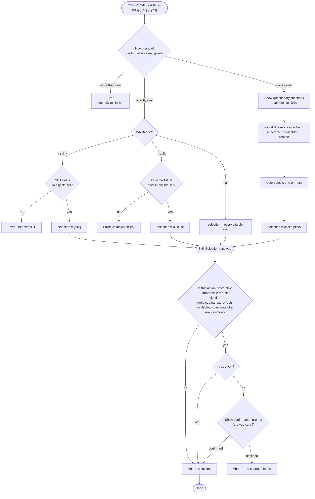

# Skill Operation Pathway

Every Skill Operation (`deploy`, `undeploy`, `cleanup`, `delete`, `mark`, `refresh`) funnels through the same three shared functions: Skill Selection resolution, picker construction, and the confirmation gate. This diagram shows that shared Skill Operation Pathway (see `CONTEXT.md` and ADR-0008); per-command variation (relevance/disabled-reason rules, confirmation scope) is summarised in the table below.

## What varies per command

| Command | `<skill>` positional | Eligible set | Disabled-in-picker reasons | Destructive? (confirm + `--yes`) |
|---|---|---|---|---|
| `deploy` | yes | all skills | "already deployed" (clean collision to every selected target) | only the `--overwrite`-into-real-directory branch |
| `undeploy` | yes | all skills | "not deployed" (to any selected target) | no |
| `cleanup` | **no** — `--bulk`/`--all` only | `state == deprecated` | none — all eligible skills stay selectable | yes, always |
| `delete` | yes | all skills (deliberately unrestricted — `--all` is a "wipe the library" escape hatch) | none | yes, always |
| `mark` | yes | all skills | none | no |
| `refresh` | yes | imported (non-self-authored) skills | "self-authored — nothing to refresh"; "modified — needs review before refresh" | yes, always |

`deploy` and `undeploy` also resolve a Deployment Target (which deployment directory) before resolving the Skill Selection, via their own existing checkbox — unchanged by this PRD. `mark` additionally prompts for `--key`/`--value` independently after skill resolution, once each is missing.
